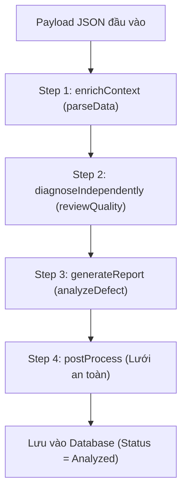

# 📘 Hướng Dẫn Toàn Tập Nghiệp Vụ, Kiến Trúc AI & Test End-to-End (E2E) — 8D Copilot

Tài liệu này cung cấp chi tiết toàn bộ kiến thức nghiệp vụ, kiến trúc xử lý AI, các màn hình cấu hình (`Similarity`, `Step Prompts`, `Model Registry`) và kịch bản **Test End-to-End (E2E)** từng bước cho ứng dụng **8D Copilot (CNMA Proresolve)**.

---

## 📋 Mục Lục

1. [Tổng Quan Nghiệp Vụ 8D Copilot](#1-tổng-quan-nghiệp-vụ-8d-copilot)
2. [Cấu Trúc Dữ Liệu Đầu Vào (Deep Structure JSON)](#2-cấu-trúc-dữ-liệu-đầu-vào-deep-structure-json)
3. [Giải Thích Các Trang Cấu Hình AI](#3-giải-thích-các-trang-cấu-hình-ai)
   - [Model Registry & General Settings](#31-model-registry--general-settings)
   - [Trang Similarity (Tìm Kiếm Tiền Lệ)](#32-trang-similarity-tìm-kiếm-tiền-lệ)
   - [Trang Step Prompts (Quản Lý Prompt D1-D8)](#33-trang-step-prompts-quản-lý-prompt-d1-d8)
4. [Luồng Xử Lý Pipeline AI (4-Step Pipeline)](#4-luồng-xử-lý-pipeline-ai-4-step-pipeline)
5. [Kịch Bản Test End-to-End (E2E Test Steps)](#5-kịch-bản-test-end-to-end-e2e-test-steps)
6. [Xử Lý Lỗi Thường Gặp (Troubleshooting)](#6-xử-lý-lỗi-thường-gặp-troubleshooting)

---

## 1. Tổng Quan Nghiệp Vụ 8D Copilot

Trong quản lý chất lượng sản xuất (SAP QM), khi phát sinh sự cố/lỗi sản phẩm (Defect Case), các kỹ sư chất lượng (Quality Engineers) phải tiến hành điều tra và lập báo cáo **8D (8 Disciplines)** để tìm nguyên nhân gốc rễ và đưa ra giải pháp khắc phục triệt để.

### 🎯 8D Copilot giải quyết vấn đề gì?
- **Tự động bóc tách & phân tích**: Nhận dữ liệu case sự cố từ SAP QM, phân tích dữ liệu đo đạc, thiết bị, quy trình.
- **Chẩn đoán mù độc lập (Independent/Blind Diagnosis)**: AI tự tìm nguyên nhân gốc khi **CẮT TOÀN BỘ ĐÁP ÁN** của kỹ sư (chuỗi 5-Why, Ishikawa, FMEA), sau đó so sánh kết luận của AI và Kỹ sư (Same conclusion / Different conclusion).
- **Tra cứu tiền lệ tương đồng (Precedent Search)**: Tra cứu các case quá khứ có đặc điểm lỗi/thiết bị tương tự để học hỏi giải pháp thật, chống bịa đặt (hallucination).
- **Dự thảo 8D Disciplines (D1 ➔ D8)** và viết 2 bản tóm tắt riêng biệt:
  - **Internal Summary**: Bản tóm tắt nội bộ (có tên thiết bị, lô sản xuất, nhân sự).
  - **Customer Summary**: Bản tóm tắt gửi khách hàng cho case `Q1 - Customer Complaint` (đã lọc bỏ thông tin nhạy cảm).

---

## 2. Cấu Trúc Dữ Liệu Đầu Vào (Deep Structure JSON)

Đầu vào cho 8D Copilot là **1 Case Notification** (Hồ sơ sự cố chất lượng SAP QM - bảng `QMEL`), chứa các thành phần lồng nhau (Deep Structure):

```json
{
  "notificationId": "8D-10048651",
  "origin": "Q1 - Customer Complaint",
  "symptomShortText": "Coating peel found at customer incoming inspection",
  "status": "In Process",
  "foundDate": "2026-08-01",
  "quantityExtent": "74 units affected",
  "teamSize": 2,
  "material": {
    "materialId": "MAT-10555",
    "description": "Housing Cover C80"
  },
  "batch": {
    "batchId": "B-51890",
    "materialId": "MAT-10555"
  },
  "defect": {
    "defectCode": "DEF-0601",
    "defectText": "Coating layer peeling"
  },
  "workCenter": {
    "workCenterId": "WC-COAT-05",
    "description": "Powder Coating Line 5"
  },
  "inspections": [
    {
      "characteristic": "Coating thickness",
      "measuredValue": "38um",
      "specValue": "60-90um"
    }
  ],
  "causesIshikawa": [
    {
      "category": "Measurement",
      "description": "Gauge GA-0117 calibration expired 2026-05-30",
      "metricValue": "-22um drift",
      "isRootCause": "Y",
      "source": "SAP: Test Equipment Mgmt"
    }
  ],
  "fiveWhyChain": [
    {
      "stepNo": 1,
      "question": "Why coating peeled?",
      "answer": "Coating thickness measured 38um against 60-90um spec",
      "evidenceCitation": "QALS/QAMR"
    },
    {
      "stepNo": 2,
      "question": "Why passed inspection?",
      "answer": "Gauge GA-0117 read 22um high",
      "evidenceCitation": "GA-0117 calibration record"
    },
    {
      "stepNo": 3,
      "question": "Why drifting gauge in service? (root cause)",
      "answer": "Calibration expired on 2026-05-30 and no interlock stopped its use",
      "evidenceCitation": "Test equipment register"
    }
  ],
  "actions": [
    {
      "lineNo": 1,
      "actionType": "Containment",
      "actionText": "Quarantine affected stock",
      "status": "Done"
    }
  ],
  "teamAssignments": [
    {
      "partnerId": "BP-100014",
      "partnerName": "Thien Tu",
      "functionTitle": "Quality Engineer",
      "partnerRole": "8D Team Leader"
    }
  ],
  "costCopq": {
    "costOfPoorQualityEur": 8600
  }
}
```

---

## 3. Giải Thích Các Trang Cấu Hình AI

Hệ thống cung cấp trang quản trị **AI Settings** (đường dẫn: `/#/ai-settings`) gồm 4 tab chính:

```
┌────────────────────────────────────────────────────────────────────────┐
│                               AI Settings                              │
├───────────────────┬────────────────┬─────────────────┬─────────────────┤
│ General Settings  │ Model Registry │   Similarity    │  Step Prompts   │
└───────────────────┴────────────────┴─────────────────┴─────────────────┘
```

### 3.1 Model Registry & General Settings
- **Model Registry**: Cho phép đồng bộ (Sync) các Foundation Model từ SAP AI Core / Generative AI Hub và bật/tắt từng model.
- **General Settings**: Cho phép gán model riêng cho từng Activity:
  - `parseData`: Chọn model cho bước đọc & cấu trúc hóa dữ liệu (ví dụ: `gemini-2.5-flash`).
  - `analyzeDefect`: Chọn model cho bước suy luận 8D & viết báo cáo (ví dụ: `gemini-2.5-pro`).
  - `reviewQuality`: Chọn model cho bước chẩn đoán mù độc lập.
  - `ThinkingBudget`: Cấu hình dung lượng token suy luận (Extended Thinking).

### 3.2 Trang Similarity (Tìm Kiếm Tiền Lệ)
- **Mục đích**: Cấu hình thuật toán & trọng số khi tìm kiếm case quá khứ tương đồng (Precedent Search). Admin chỉnh trọng số trực tiếp trên UI mà **không cần sửa code hay deploy lại server**.
- **Bảng Tiêu chí (`SimilarityCriteria`)**:
  - `workCenter` (+4đ): So sánh trùng trạm máy / dây chuyền.
  - `defectCode` (+4đ / fallback trùng từ khóa +2đ): So sánh trùng mã lỗi.
  - `material` (+3đ / fallback trùng nhóm vật tư +1đ): So sánh trùng mã vật tư.
  - `semantic` (+3đ): Chấm điểm khoảng cách vector (Cosine Similarity) giữa văn bản mô tả lỗi với ngưỡng `minSimilarity >= 0.70`.
- **Cấu hình Ngưỡng (`RetrievalSettings`)**:
  - `minScore` (mặc định $\ge 3$ điểm): Nếu case cũ có tổng điểm $< 3$ thì không lấy làm tiền lệ (tránh gợi ý sai).
  - `topN` (mặc định `3`): Lấy tối đa N case tiền lệ tương đồng nhất.
  - `closedOnly` (`true`): Chỉ chọn các case đã đóng (`Completed`/`Closed`).

### 3.3 Trang Step Prompts (Quản Lý Prompt D1-D8)
- **Mục đích**: Cho phép Admin tùy chỉnh trực tiếp `systemPrompt` và `userTemplate` cho từng bước từ **D1 đến D8** trên giao diện.
- **Cơ chế Fallback**: Nếu tắt (`enabled = false`) hoặc để trống, hệ thống sẽ tự động dùng Prompt mặc định chuẩn trong code (`srv/src/domain/eightd/prompts.ts`).

---

## 4. Luồng Xử Lý Pipeline AI (4-Step Pipeline)

Khi người dùng gửi JSON case (`analyzeFromJson`), backend xử lý theo 4 bước:



1. **Step 1: enrichContext (`parseData`)**: Bóc tách dữ liệu, tính toán chỉ số, phát hiện lỗ hổng dữ liệu (`gaps`).
2. **Step 2: diagnoseIndependently (`reviewQuality`)**: Chẩn đoán mù — Cắt bỏ đáp án của kỹ sư, cho AI tự lập luận chuỗi 5-Why và chọn nhánh Ishikawa.
3. **Step 3: generateReport (`analyzeDefect`)**: Tổng hợp dữ liệu + kết quả chẩn đoán mù + các case tiền lệ để viết nội dung D1-D8, Internal Summary và Customer Summary.
4. **Step 4: postProcess (Lưới an toàn)**: Kiểm tra lại các ràng buộc, sửa lỗi định dạng JSON, kiểm tra citation nguồn.

---

## 5. Kịch Bản Test End-to-End (E2E Test Steps)

### 🚀 Bước 1: Khởi động hệ thống
1. Mở terminal tại thư mục dự án `8d-copilot`.
2. Khởi động full-stack:
   ```bash
   npm run dev:all
   ```
   - **Backend**: `http://localhost:4004`
   - **Frontend UI**: `http://localhost:5544`

---

### ⚙️ Bước 2: Test Cấu Hình AI Settings
1. Truy cập browser: `http://localhost:5544/#/ai-settings`.
2. **Test Tab Model Registry**:
   - Bấm nút **Sync Models**.
   - Xác nhận danh sách các model từ AI Core được tải về thành công.
3. **Test Tab General Settings**:
   - Gán `parseData` ➔ `gemini-2.5-flash`.
   - Gán `analyzeDefect` ➔ `gemini-2.5-pro`.
   - Bấm **Save configuration** ➔ Thấy thông báo *"AI configuration saved"*.

---

### 🔍 Bước 3: Test Trang Similarity & Step Prompts
1. **Test Tab Similarity**:
   - Chỉnh `minScore` = `3`, `topN` = `3`.
   - Thử thay đổi trọng số của *Work Center* từ `4` ➔ `5`.
   - Bấm **Save criteria**.
2. **Test Tab Step Prompts**:
   - Chọn bước **D4 (Root Cause)**.
   - Thêm câu chỉ thị vào *System Prompt*: `Always check equipment calibration date.`
   - Bấm **Save Step Prompts**.

---

### 📄 Bước 4: Test Phân Tích Case 8D từ JSON
1. Mở trang **8D Reports**: `http://localhost:5544/#/8d`.
2. Bấm nút **Analyze from JSON** (Icon ✨).
3. Copy toàn bộ nội dung file Deep Structure JSON mẫu ([case-8D-10048651.json](file:///d:/Thien/Work/Hackathon/8d-copilot/mock-data/clean/case-8D-10048651.json)) và dán vào ô nhập.
4. Bấm **Start Analysis**.

---

### 📊 Bước 5: Kiểm Tra Kết Quả Chi Tiết Report
1. Trình duyệt tự chuyển sang trang Chi tiết Report (`http://localhost:5544/#/8d/<ID>`).
2. Trạng thái ban đầu: `Analyzing` (thông báo nền màu xanh).
3. Sau khoảng 30–60 giây, trang tự động cập nhật sang trạng thái `Analyzed`.
4. **Kiểm tra các phần hiển thị**:
   - ✅ **Reasoning Panel (Chẩn đoán độc lập)**: Kiểm tra AI chọn nhánh nguyên nhân gốc (`Measurement`) và đối chiếu xem có trùng với Kỹ sư (`Same conclusion`) hay không.
   - ✅ **Internal Summary & Customer Summary**: Kiểm tra nội dung tóm tắt cho case `Q1`.
   - ✅ **Eight Disciplines (D1 ➔ D8)**: Kiểm tra nội dung D4 có tuân theo chỉ thị Prompt vừa sửa không.
   - ✅ **AI Models Used (Footer)**: Kiểm tra thông tin vết chạy hiển thị đúng model đã gán:
     - `Parse: gemini-2.5-flash`
     - `Analyze: gemini-2.5-pro`
     - Số token và thời gian thực thi (seconds).

---

## 6. Xử Lý Lỗi Thường Gặp (Troubleshooting)

| Hiện tượng | Nguyên nhân | Cách khắc phục |
|:---|:---|:---|
| **Lỗi `SQLITE_ERROR: no such table`** | File DB `sqlite.db` chưa được khởi tạo schema | Chạy lệnh `npm run deploy:sqlite` |
| **API gọi AI báo `timeout of 30000ms exceeded`** | Client Axios bị dính giới hạn timeout 30s | Đã sửa `timeout: 0` trong `axios-instance.ts` |
| **Trang AI Settings không chọn được model** | Chưa chạy **Sync Models** hoặc thiếu credential AI Core | Kiểm tra file `.env` chứa credential `AICORE_*` và bấm **Sync** |
| **Giao diện không mở đúng cổng 5544** | File `vite.config.ts` bị đè | Kiểm tra `server.port = 5544` trong `vite.config.ts` |

---

*Tài liệu này được biên soạn cho dự án **8D Copilot (CNMA Proresolve)**.*
